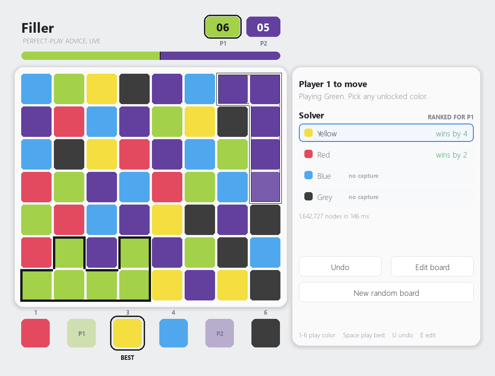

# Filler

A two-player desktop version of **Filler**, the GamePigeon game, with a perfect-play solver
running alongside it. The board is an 8×7 grid of six colors. Player 1 starts from the
bottom-left tile, player 2 from the top-right. On your turn you pick a color — any color
except your own and your opponent's — and every tile of that color touching your territory
becomes yours. When the board is full, whoever holds more tiles wins.

The solver searches the game to the end with alpha-beta, so the move it shows is not a
heuristic guess: it is the move that wins if a win is available, and among winning moves the
one that wins by the most tiles.



## Requirements

- **Python 3.10+** with **pygame** (`pip install pygame`)
- A **C++20** compiler on your `PATH` — `g++` or `clang++`
  - Windows: [MSYS2](https://www.msys2.org/) (`pacman -S mingw-w64-ucrt-x86_64-gcc`) or any MinGW-w64
  - Linux: `sudo apt install build-essential`
  - macOS: `xcode-select --install`

C++20 is required for `std::popcount` from `<bit>`.

## Running it

```bash
python filler.py
```

That's the whole install. `solver.cpp` is compiled automatically on first launch (a couple of
seconds, once) and rebuilt whenever you edit it, so there is no separate build step. The
compiled solver then runs as a single background process for the lifetime of the window.

## How to play

The app opens in the **board editor** on a random legal board.

| | |
|---|---|
| Click a color, then click or drag on the board | paint tiles |
| Right-click | erase a tile |
| **Who moves first** | pick player 1 or player 2 |
| `R` / `C` | randomize / clear the board |
| `S` | swap who starts |
| `1`–`6` | pick a paint color |
| `Enter` | start the game |

Player 1 always owns the bottom-left corner and player 2 the top-right, but either can take
the opening move. Moving first is worth a lot on a random board, so this is the main way to
hand the advantage over.

**Start** stays disabled until the board is legal, and the panel tells you what is wrong.
The only rule is that no two orthogonally adjacent tiles may share a color — see
[Editing rules](#editing-rules) for why that one matters.

Once you start, both players share the keyboard and mouse:

| | |
|---|---|
| Click an unlocked swatch, or `1`–`6` | play that color |
| Hover a swatch | outline exactly which tiles you would capture |
| `Space` | play the solver's recommendation |
| `U` | undo |
| `E` | back to the editor |
| `Esc` | quit |

The two locked swatches are the players' current colors, and the solver's pick is ringed with
**BEST**. The panel lists every legal move ranked strongest first, each with its verdict under
perfect play from both sides as a final score — *wins by 6*, *loses by 2*, *draw*. That is the
exact margin the game will finish on if neither side errs, not an estimate. Moves that capture
nothing are tagged *no capture*, sort last, and deliberately carry no score — see
[the protocol notes](#solver-protocol) for why no comparable number exists for them.

The bar across the top is the same number drawn as a chess-style eval bar, in the two
players' current colors. It shows how the 56 tiles are predicted to end up divided: dead
centre is a draw, and *player 1 wins by 8* puts the split at 32 tiles to 24. Territory on the
board is outlined rather than shaded, so you can still read the colors underneath — player
1's border is solid dark, player 2's is white.

### Editing rules

A real Filler board never has two adjacent tiles of the same color, and the editor enforces
that. It is not cosmetic. Because neutral tiles never change color, that property means a
capture can never chain — the tiles you take are exactly the ones already touching your
territory. The solver relies on this and expands by a single step, so a board that breaks
the rule would get silently wrong answers.

Matching home corners **are** allowed. Whoever moves first simply leaves that color behind on
their opening turn, and they get five legal colors to choose from instead of four.

## How it works

The split is deliberate: Python owns the rules and the pixels, C++ owns the search.

- **`filler.py`** — the pygame front end. It enforces the game rules itself, so the GUI stays
  correct and playable even if the solver never starts. It compiles `solver.cpp` on demand,
  keeps one solver process alive, and queries it from a worker thread so the window never
  blocks on a search.
- **`solver.cpp`** — the engine. Bitboard state in a `uint64_t` per color, minimax with
  alpha-beta, a transposition table, and moves ordered by capture size. Wrapped in a
  request/response loop over stdin/stdout.
- **`main.cpp`** — the original standalone text version. Still works on its own; the GUI does
  not use it.

The opening is the expensive position: median around 0.6s, occasionally a few seconds, and
rarely much longer. Everything after it averages about a tenth of a second, and the search
only gets cheaper as the board fills. It runs on a worker thread, so the window stays
responsive while it thinks.

### Solver protocol

One request per line group, one response per line group:

```
> SOLVE
> <56 chars>    tile colors, '0'..'5', index i = y*8 + x, y = 0 is the bottom row
> <56 chars>    owners, '.' neutral / '0' player 1 / '1' player 2
> <p1_color> <p2_color> <side_to_move>

< OK
< BEST <best_color> <color>:<score>:<captures>,...
< NODES <n> <milliseconds>
< END
```

Every legal color is scored. A score is the final margin in tiles, always from player 1's
point of view: `+8` means player 1 finishes 8 tiles ahead with perfect play from both sides,
`-8` that player 2 does, `0` a draw. `captures` is how many tiles that color claims
immediately. `best_color` is `-1` when the game is already over. `QUIT` ends the process.
Only the side to move is searched.

One caveat on the scores. Below the root, the search never lets a player decline an available
capture — that restriction is what makes the game terminate, since two players who both keep
passing would never fill the board. So when a *root* move declines a capture, its score comes
from a search in which the opponent is barred from passing back, which makes it read better
than it really is. Those moves are reported (with `captures` at 0) but are never chosen as
`best_color`, and the GUI ranks them last and shows no score for them at all. Treat their
score as an upper bound, not a value: the true figure is that or worse, by an unknown amount.

## Troubleshooting

**`no g++ or clang++ on PATH, and solver is not built`** — install a compiler (see above), or
build the solver by hand and drop it next to `filler.py`. On Windows it must be named
`solver.exe`:

```bash
g++ -O2 -std=c++20 -static -o solver.exe solver.cpp
```

On Linux and macOS it must be named `solver` (and drop `-static`, which macOS does not
support):

```bash
g++ -O2 -std=c++20 -o solver solver.cpp
```

**The compile fails with exit code 1 and no error message** — on Windows this usually means a
second MinGW installation earlier on your `PATH` (Git for Windows ships one) is shadowing the
runtime DLLs your compiler needs. `filler.py` already works around this by putting the
compiler's own directory first, so if you hit it while building by hand, do the same.

**`No module named 'pygame'`** — you have more than one Python and `python` is resolving to
the wrong one. Check with `python -c "import pygame"`. On Windows, the `py` launcher usually
picks the right interpreter: `py filler.py`. This bites in particular if MSYS2 is on your
`PATH`, since it ships its own `python` that will not see packages you installed elsewhere.

## Credits

- **[mattbatwings](https://youtube.com/mattbatwings)** — the game logic and the solver: the
  bitboard representation, expansion, and the minimax search that everything else is built
  around.
- **Claude** (Anthropic's Claude Code) — the pygame GUI, the board editor, and the
  request/response wrapper that lets Python talk to the engine.
